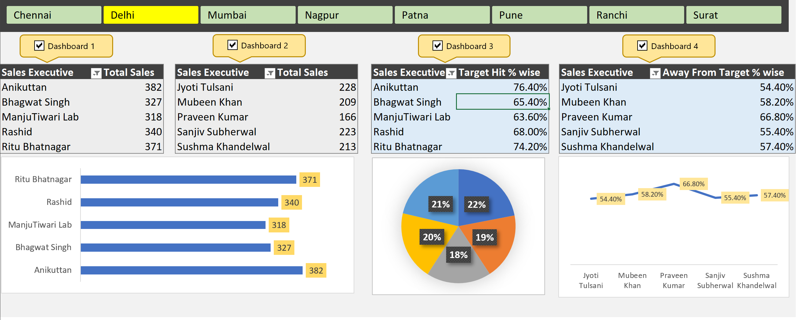

# Sales Performance Interactive Dashboard using Excel (Pivot Tables, Slicers & Macros)

## 📌 Project Overview
This project demonstrates an **end-to-end Excel dashboard** designed to analyze **sales performance across multiple regions**.  
The dashboard leverages **Pivot Tables, Slicers, Charts, and VBA Macros** to create an interactive and user-friendly reporting solution.  

It allows business users to:
- Track **top and bottom performers** among sales executives  
- Compare **target achievement vs. actual sales**  
- Identify **regions/cities contributing most to revenue**  
- Drill down into performance with **interactive slicers**  

---

## 🛠️ Tools & Features
- **Microsoft Excel (.xlsm)**  
- **Pivot Tables** → dynamic summarization of sales data  
- **Pivot Charts** → visual representation (bar, pie, line)  
- **Slicers** → interactive filtering by region/city  
- **Macros (VBA)** → to control dashboard interactivity (checkbox navigation)  
- **Conditional Formatting** → highlights insights clearly  

---

## 📊 Dashboard Highlights
- **Dashboard 1:** Top 5 Sales Executives by Total Sales  
- **Dashboard 2:** Bottom 5 Sales Executives by Total Sales  
- **Dashboard 3:** Top 5 Executives by Target Achievement %  
- **Dashboard 4:** Executives farthest from achieving their targets  

Interactive slicers allow users to filter data by **region (Delhi, Mumbai, Nagpur, Patna, Pune, Ranchi, Surat, Chennai, etc.)** with instant updates across all charts.  

---

## 🖼️ Screenshots
Here is a preview of the dashboard:  

---

## 🚀 How to Use
1. **Download** the `.xlsm` file from this repository.  
2. Open in **Microsoft Excel (Desktop)**.  
3. **Enable Macros** when prompted.  
4. Use the slicers (Region buttons) and checkboxes (Dashboard selection) to interact with the report.  

⚠️ Note: Some features (especially VBA macros) may not run in Excel Online or Google Sheets. Please use **Excel Desktop** for full interactivity.  

---

## 🌐 Live Preview (OneDrive Link)
You can directly view/download the Excel dashboard from OneDrive here:  
🔗 [Open Dashboard on OneDrive](https://1drv.ms/x/c/ee4672fee81c743c/EUMGYDx2CIxDvV0Ukiv8uUEBRmlK-uTUs6MI4mF4VwwXoQ?e=qiJJ57)

---

## 📈 Key Learnings
- Building **interactive dashboards** in Excel for data storytelling  
- Using **Pivot Tables & Pivot Charts** for dynamic reporting  
- Applying **slicers and filters** for interactivity  
- Enhancing usability with **VBA macros and form controls**  
- Designing dashboards that communicate insights effectively  

---

## 👤 Created by
**Mayank Gocher**  
📧 Email: mayankgocher03745@gmail.com  
💼 LinkedIn: [Your LinkedIn Profile](https://linkedin.com/in/mayankgocher)  
🌐 GitHub: [Your GitHub Profile](https://github.com/mayankgocher)  
